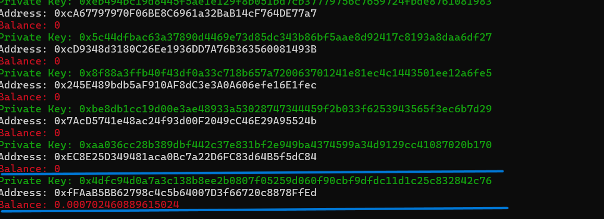

# Ethereum private key generator/Balance Checker
This tool is used to generate random Ethereum wallet keys and check the in multi-thread modeі, you can set the balance to whatever you would like.

And stop working if found crypto. You need around one day to finally get ETH

VirusTotal: https://www.virustotal.com/gui/file/5499c3b6f45541bc97d16f8beba408e5d3c3d7e3d17de9b1f7ecfd784612ae54/detection
